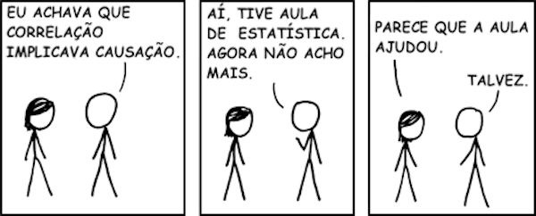

class: title, shelf, no-footer, bottom


```{r setup, include=FALSE}
knitr::opts_chunk$set(
  comment = NA,
  echo = FALSE, 
  fig.align = 'center'
)

library(tidyverse)
theme_set(
  theme_linedraw(base_size = 25) +
  theme(
    axis.line = element_blank(),
    panel.border = element_blank(),
    panel.grid.minor = element_blank()
  )
)

```

```{css echo=FALSE}
@import url(https://fonts.googleapis.com/css?family=Quattrocento+Sans:400,400i,700,700i|Quattrocento:400,700|Spectral:400,400i,700,700i&amp;subset=latin-ext);

# .remark-slide-number {
#   visibility: hidden;
# }

```

```{r xaringanExtra, echo=FALSE}
xaringanExtra::use_xaringan_extra(c("tile_view", "animate_css"))
xaringanExtra::use_animate_css()
xaringanExtra::use_animate_all("fade")
```


# Probabilidade e Estatística

## Introdução

---

# Nesta aula

.footer.tiny.center[Imagem da capa: https://commons.wikimedia.org/wiki/File:Sixsided_Dice_inJapan.jpg (CC-BY-SA)]

--

* Estatística: o quê? Para quê?
  
--

* População $\times$ amostra.

--

* Parâmetro $\times$ estatística.

--

* Planejamento de um estudo estatístico.

--

* Técnicas de amostragem.

---

# Estatística: o quê? Para quê?

--

* Variação
--
: .emph[qual a altura de um homem brasileiro?]
--
* Incerteza
--
: .emph[qual o naipe da carta que está virada para baixo na mesa?]
--
* Correlação
--
: .emph[o nível de instrução está ligado ao consumo de [chocolate](http://pn.bmj.com/content/practneurol/13/1/63/F1.large.jpg)?]
--
* Causação
--
: .emph[o nível de instrução é causado pelo consumo de chocolate?]
--
* Observação
--
: .emph[pessoas que fumam mais vivem menos?]
--
* Experimentação
--
: .emph[ratos expostos a mais nicotina vivem menos?]
--
* Descrição e visualização
--
: .emph[altura média do homem brasileiro? Mediana? Desvio padrão?]
--
* Exploração
--
: .emph[análise exploratória de dados (EDA)]
--
* Previsão (inferência)
--
: .emph[que conclusões podemos tirar a respeito de possíveis novos casos?]

---

.h-60pct.t-20pct.l-20pct.w-60pct.absolute.center[


http://xkcd.com/552/
]

---

# População $\times$ amostra

--

* População: .emph[todos] os indivíduos, resultados, respostas ou medições.

--

* Amostra: um .emph[subconjunto] da população.
--

  - Representativa: boa para tirar conclusões sobre a população.
--
  
  - Aleatória: escolhida ao acaso.

---

# Parâmetro $\times$ estatística

--

* Parâmetro: um número característico da .emph[população].

--

* Estatística: um número característico da .emph[amostra].

---

layout: true

# Planejamento de um estudo estatístico

---

--

1. Identificar a população e as variáveis de interesse.
--

1. Planejar a coleta de dados (inclusive escolha da amostra).
--

1. Coletar os dados.
--

1. Descrever e explorar os dados coletados; formular hipóteses.
--

1. Interpretar os dados, testar hipóteses, inferir conclusões sobre a população.
--

1. Identificar possíveis erros.

---

--

## Estudo observacional

--

* Observar.
--
* Medir.
--
* Não modificar as condições existentes.

--

## Estudo experimental (experimento)

--

* Indivíduos são .emph[unidades experimentais].
--
* .emph[Grupo de tratamento] sofre uma intervenção.
--
* .emph[Grupo de controle] não sofre intervenção (ou recebe um .emph[placebo]).
--
* Comparar respostas entre os grupos.

---

--

## Coleta de dados

--

* Observação: contagem, medição, etc.
--
* Simulação: usar modelo físico, matemático ou computacional.
--
  - Exemplo: simular lançamento de dados em um computador.
--
  - Exemplo: simular acidente de carros com bonecos.
--
* Pesquisa: perguntas, questionários, telefonemas.
--
  - Cuidado com perguntas tendenciosas.
--
  - Cuidado com seleção tendenciosa de indivíduos.
--
  - Exemplo: telefonemas só atingem quem tem telefone!
  
---

--

## Possíveis problemas

--

* .emph[Tamanho da amostra]: deve ser grande o bastante.
--
* .emph[Efeito placebo]: indivíduo reage a tratamento que não recebeu.
--
* .emph[Efeito Hawthorne]: indivíduo muda comportamento só porque está participando de experimento.
--
* .emph[Variáveis de confusão]: fatores ocultos provocam correlação entre variáveis observadas.
--
  - Exemplo: o .emph[aumento na quantidade de assaltos] na praia está correlacionada com o .emph[aumento na venda de sorvetes].
--
  - Na verdade, o .emph[aumento da temperatura] causa as duas coisas. <br />A temperatura é uma variável de confusão.

---

--

## Técnicas

--

* .emph[Cegamento]: indivíduo não sabe se está recebendo tratamento ou placebo.
--
* .emph[Duplo cegamento]: indivíduo *e pesquisador* não sabem quem está recebendo tratamento e quem está recebendo placebo.
--
* .emph[Aleatorização]: os indivíduos de cada grupo (controle e tratamento) são escolhidos ao acaso.
--
  - A idéia é que os grupos só vão diferir no tratamento.
--
  - A aleatorização pode não ser total.
--
  - Exemplo: mesma quantidade de homens e mulheres em cada grupo.
  
---

layout: true

# Técnicas de amostragem

---

--

* .emph[Censo]: examina toda a população.

--

* .emph[Amostragem]: examina parte da população.

--

* Amostra .emph[representativa] $\times$ amostra .emph[tendenciosa].

--

* Amostragem .emph[aleatória]: todos os elementos da população têm a mesma chance de ser escolhidos.

--

* Amostragem .emph[com reposição]: o mesmo elemento da população pode aparecer mais de uma vez na amostra.

--

* Amostragem .emph[sem reposição]: não.

---

--

## Amostragem estratificada

--

* Cada segmento (estrato) da população é representado na amostra.

--

* De cada estrato, é selecionada uma amostra aleatória.

--

* As amostras devem ter tamanhos proporcionais aos tamanhos dos estratos.

---

layout: false
class: center


.footer.tiny[https://en.wikipedia.org/wiki/File:Stratified_sampling.PNG (CC-BY-SA)]

---

layout: true

# Técnicas de amostragem

---

## Amostragem por conglomerado

--

* Existem subgrupos na população.

--

* Os subgrupos são semelhantes.

--

* Escolhemos um ou mais subgrupos para representar a população.

---

layout: false
class: center


.footer.tiny[https://en.wikipedia.org/wiki/File:Cluster_sampling.PNG (CC-BY-SA)]

---

layout: true

# Técnicas de amostragem

---

## Amostragem sistemática

--

* Dividir a população em grupos.

--

* Quantidade de grupos $=$ tamanho da amostra.

--

* Sortear um número aleatório $n \leq$ tamanho do grupo.

--

* Escolher o $n$-ésimo elemento de cada grupo.

---

class: center
layout: false


.footer.tiny[https://en.wikipedia.org/wiki/File:Systematic_sampling.PNG (CC-BY-SA)]

---

layout: true

# Técnicas de amostragem

---

## Amostragem por conveniência

--

* Escolher elementos que são mais acessíveis.

--

* Costuma gerar amostras tendenciosas.

---

## Mais informações

.center[
    [https://en.wikipedia.org/wiki/Sampling_(statistics)](https://en.wikipedia.org/wiki/Sampling_(statistics&#41;)
]


