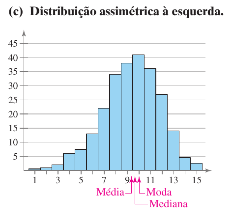
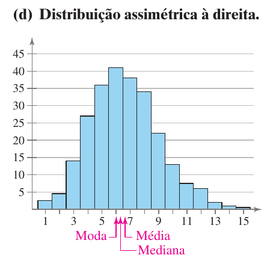

```{r setup, include=FALSE}
library(knitr)

opts_chunk$set(
  echo = TRUE, 
  # collapse = TRUE,
  # cache = TRUE,
  out.width = "90%",
  fig.align = 'center',
  fig.width = 7,
  fig.show = "hold"
)

# Supress crayon output
options(crayon.enabled = FALSE)

options(
  # width of R code output
  width = 80,
  # Avoid scientific notation
  scipen = 15,
  # Use a comma as decimal separator
  OutDec = ',',
  # Number of decimal digits for numbers produced by inline R code
  fmdigits = 2
)

# Useful libraries
library(glue)
library(patchwork)
library(latex2exp)
library(kableExtra)
options(knitr.kable.NA = '')

# For nice dataframe summaries
library(summarytools)
st_options(
  plain.ascii = FALSE,
  dfSummary.varnumbers = FALSE,
  dfSummary.style = 'grid',
  dfSummary.graph.magnif = .75
)

# Tidy!
library(tidyverse)

# For modes
library(modeest)

# Useful functions provided by the rmdformat package
# 
# Execute 
# 
#   cat(system.file("rmarkdown/resources/common.R", package = "rmdformat"))
# 
# to see the location of the file
source(
  system.file(
    "rmarkdown/resources/common.R",
    package = "rmdformat"
  )
)
```


# Medidas de centralidade

## Média

### De uma população

* Média de uma população: 
  $$\mu = \frac{\sum x}{N}$$

* $\sum x$ é a soma de todos os dados $x$.

* $N$ é a quantidade de elementos na população.

### De uma amostra

* Média de uma amostra:
  $$\bar x = \frac{\sum x}{n}$$

* $\sum x$ é a soma de todos os dados $x$.

* $n$ é a quantidade de elementos na amostra.

### Exemplo

Idades dos alunos de uma turma:

```{r idades}
idades <- c(
  20, 20, 20, 20, 20, 20, 21, 21, 21, 21, 22, 22, 22, 23, 23, 23, 23, 24, 24, 65
)
```

Média com o velhinho:

```{r media}
mean(idades)
```

Média sem o velhinho:

```{r media2}
mean(idades[-length(idades)])
```


## Mediana

* Já vimos no vídeo sobre *boxplots*.

* 50% dos dados à esquerda, 50% à direita.

* Não é tão sensível a *outliers*.

### Exemplo

Mediana com o velhinho:

```{r mediana}
median(idades)
```

Mediana sem o velhinho:

```{r mediana2}
median(idades[-length(idades)])
```


# Formas de uma distribuição

* O histograma mostra aspectos importantes de uma distribuição.

* A *moda* é o valor mais comum. Pode haver mais de uma moda.

* Uma função para retornar um histograma:

```{r plot-hist}
histograma <- function(
  dados,
  divisoes = floor(min(dados)):ceiling(max(dados))
) {
  
  dados %>% 
    as_tibble() %>% 
    ggplot(aes(x = value)) +
      geom_histogram(breaks = divisoes, color = 'black', fill = '#00000000') +
      scale_x_continuous(breaks = divisoes)
  
}
```

* Histograma das idades da turma:

```{r idades-hist}
histograma(idades)
```


## Distribuição Uniforme

```{r uniforme}
uniforme <- runif(1000, min = 0, max = 10)

histograma(uniforme) 
```

* A distribuição uniforme não tem moda.


## Simétrica

```{r simetrica}
sim <- rnorm(1000, mean = 5, sd = 2)
histograma(sim)
```

* A distribuição uniforme também é simétrica.

* Esta distribuição é unimodal.

* A média, a mediana e a moda coincidem:

```{r media-mediana}
mean(sim)
median(sim)
```

* Por que não existe uma função para a moda em R? Porque, por incrível que pareça, é complicado calcular a moda para dar resultados interessantes.

```{r mfv}
# Por causa de um bug na função mfv, 
# precisamos de números com ponto decimal
# (em vez de vírgula)
options(OutDec = '.')
mfv(sim)
options(OutDec = ',')
```

* Um método possível: centro do intervalo mais curto que contém metade das observações:

```{r mlv}
mlv(sim, method = 'venter')
```

* **Exercício**: arrendondar os valores no vetor `sim` para 3 casas decimais e usar `mfv` para descobrir a(s) moda(s).


* Uma distribuição bimodal:

```{r bimodal}
sim2 <-  rnorm(1000, mean = 12, sd = 2)
bimodal <- c(sim, sim2)

histograma(bimodal)
```

## Assimétrica

```{r figs-assim, fig.align='center', out.width='75%', echo=FALSE}


```

* Um exemplo: salários de CEOs

```{r ceos}
df <- read_csv('./CEO_Salary_2012.csv')
glimpse(df)
```

```{r salarios}
salarios <- df %>% 
  select(Name, valor = `1-Year Pay ($mil)`)
```


```{r ceos-hist}
salarios %>% 
  ggplot(aes(x = valor)) +
    geom_histogram(breaks = seq(0, 150, 2.5)) +
    scale_x_continuous(breaks = seq(0, 150, 10))
```

```{r sumario-ceos}
# Por causa de um bug na função mfv, 
# precisamos de números com ponto decimal
# (em vez de vírgula)
options(OutDec = '.')
sumario <- salarios %>% 
  summarise(
    media = mean(valor),
    mediana = median(valor),
    moda = list(mfv(valor))
  )
options(OutDec = ',')

sumario
```

```{r modas-ceos}
sumario$moda
```

```{r ceos-zero}
salarios %>% 
  filter(valor %in% sumario$moda[[1]])
```


```{r maior}
salarios %>% 
  filter(valor == max(valor))
```


# Re-expressão

```{r ceos-log}
salarios_log <- salarios %>% 
  mutate(log_valor = log10(valor))
```

```{r ceos-log-hist}
salarios_log %>% 
  ggplot(aes(x = log_valor)) +
    geom_histogram()
```


# Medidas de posição

## Quantis

```{r quantis}
salarios %>% 
  pull(valor) %>% 
  quantile()
```

```{r decil-1}
salarios %>% 
  pull(valor) %>% 
  quantile(c(.01, .05, .1))
```

```{r ceos-boxplot}
salarios %>% 
  ggplot(aes(y = valor)) +
    geom_boxplot() +
    scale_x_continuous(breaks = NULL) +
    scale_y_continuous(breaks = seq(0, 150, 10))
```


# Medidas de dispersão

## Amplitude

```{r idades-reprise}
idades
```


```{r amplitude}
range(idades)
```

```{r amplitude2}
range(idades)[2] - range(idades)[1]
```

## IQR

```{r idades-bp}
idades %>% 
  as_tibble() %>% 
  ggplot(aes(y = value)) +
    geom_boxplot() +
    scale_x_continuous(breaks = NULL) +
    scale_y_continuous(breaks = seq(20, 70, 5))
```

```{r idades-sumario}
summary(idades)
```

```{r idades-iqr}
IQR(idades)
```

```{r salarios-iqr}
IQR(salarios$valor)
```

## Variância

* Pesos e alturas de um time de basquete:

```{r pesos-alturas}
medidas <- tibble(
  altura = .025 * c(72, 74, 68, 76, 74, 69, 72, 79, 70, 69, 77, 73),
  peso = 0.45 * c(180, 168, 225, 201, 189, 192, 197, 162, 174, 171, 185, 210)
)

medidas
```


```{r alturas-sumario}
summary(medidas$altura)
```

```{r pesos-sumario}
summary(medidas$peso)
```

### Desvios

* Diferenças entre cada valor e a média:

```{r desv}
d_medidas <- medidas %>% 
  mutate(
    d_altura = altura - mean(altura),
    d_peso = peso - mean(peso)
  )

d_medidas
```

* Vamos calcular os desvios médios!

```{r desv-medio}
d_medidas %>% 
  summarize(
    d_medio_altura = mean(d_altura),
    d_medio_peso = mean(d_peso)
  )
```

### Desvios quadrados

* Como resolver isto? Elevando os desvios ao quadrado!

```{r dq}
dq_medidas <- d_medidas %>% 
  mutate(
    dq_altura = d_altura^2,
    dq_peso = d_peso^2
  )

dq_medidas
```

### Variância

* É o desvio quadrado médio.

```{r var-medidas}
dq_medidas %>% 
  summarize(
    var_altura = mean(dq_altura),
    var_peso = mean(dq_peso)
  )
```

* As unidades são $m^2$ e $kg^2$!


## Desvio-padrão

* É a raiz quadrada da variância.

* As unidades são as mesmas que as dos dados.

```{r dp-medidas}
dq_medidas %>% 
  summarize(
    dp_altura = sqrt(mean(dq_altura)),
    dp_peso = sqrt((mean(dq_peso)))
  )
```

* Claro que o R tem funções para calcular isso:

```{r var-dp-medidas}
medidas %>% 
  summarize(
    altura_dp = sd(altura),
    peso_dp = sd(peso)
  )
```

* O que houve?

## Definições

### Variância populacional

$$
\sigma^2 = \frac{\sum (x - \mu)^2}{N}
$$

### Desvio padrão populacional

$$
\sigma = \sqrt{\frac{\sum (x - \mu)^2}{N}}
$$


### Variância amostral

$$
s^2 = \frac{\sum (x - \bar x)^2}{n-1}
$$

### Desvio padrão amostral

$$
s = \sqrt{\frac{\sum (x - \bar x)^2}{n -1}}
$$

* R calcula a versão *amostral* destas medidas.


# Coeficiente de variação

* Proporção entre desvio padrão e média:

$$
CV = \frac{s}{\bar x}
$$

* Não tem unidades. É uma razão, que também pode ser lida como uma percentagem.

* Para alturas:

```{r cv-altura}
statip::cv(medidas$altura)
```

* Para pesos:

```{r cv-peso}
statip::cv(medidas$peso)
```

# Escores padrão

* Mudar a escala de uma variável, mudando as unidades:

  * A média passa a ser zero.
  * O desvio-padrão passa a ser 1.
  * I.e., a unidade passa a ser 1 desvio padrão
  
* Se a média for $\bar x$ e o desvio padrão for $s$, basta criar a nova variãvel $z$, tal que
$$
z = \frac{x - \bar x}{s}
$$


* Em R, a função `scale` faz isso:

```{r score-altura}
medidas$altura_padrao <- scale(medidas$altura)

medidas %>% 
  select(altura, altura_padrao)
```

```{r score-altura2}
mean(medidas$altura_padrao)
sd(medidas$altura_padrao)
```

```{r score-peso}
medidas$peso_padrao <- scale(medidas$peso)

medidas %>% 
  select(peso, peso_padrao)
```

```{r score-peso2}
mean(medidas$peso_padrao)
sd(medidas$peso_padrao)
```

```{r peso-hist}
medidas %>% 
  ggplot(aes(x = peso)) +
    geom_histogram(bins = 6)
```

```{r peso-padrao-hist}
medidas %>% 
  ggplot(aes(x = peso_padrao)) +
    geom_histogram(bins = 6)
```


# Teorema de Tchebychev


::: {.rmdimportant}

Em *qualquer* distribuição, a proporção de dados dentro de $\pm k$ desvios padrão ($k > 1$) da média é de, *no mínimo*
$$
1 - \frac{1}{k^2}
$$

:::

### Exemplo {-}

```{r msleep}
df <- msleep$sleep_total %>% 
  as_tibble()
```

```{r msleep-hist}
grafico <- df %>% 
  ggplot(aes(x = value)) +
    geom_histogram(breaks = 1:20) +
    scale_x_continuous(breaks = 1:20) +
    scale_y_continuous(breaks = seq(0, 10, 2))

grafico
```

```{r tchebyshev}
media <- mean(df$value)
dp <- sd(df$value)

k <- 1.3

inicio <- media - k * dp
fim <- media + k * dp

proporcao <- 1 - 1 / k^2

grafico +
  geom_histogram(
    data = df %>% 
      filter(value >= inicio & value <= fim),
    fill = 'red',
    breaks = 1:20
  ) +
  labs(
    title = paste('Exemplo do teorema de Tchebychev: k =', k),
    subtitle = paste(
      'Pelo menos', round(proporcao, 2), 'dos dados estão na área vermelha',
      '\nmédia =', round(media, 2),
      '\ndp =', round(dp, 2)
    )
  )
```

