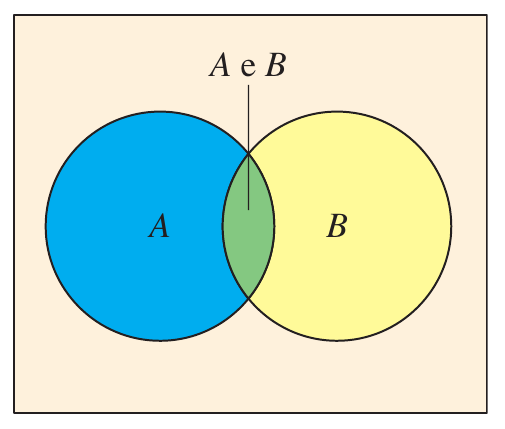

```{r setup, include=FALSE}
library(knitr)

opts_chunk$set(
  echo = TRUE, 
  # collapse = TRUE,
  # cache = TRUE,
  out.width = "90%",
  fig.align = 'center',
  fig.width = 7,
  fig.show = "hold"
)

# Supress crayon output
options(crayon.enabled = FALSE)

options(
  # Avoid scientific notation
  scipen = 15,
  # Use a comma as decimal separator
  OutDec = ',',
  # Number of decimal digits for numbers produced by inline R code
  fmdigits = 2
)

# Useful libraries
library(glue)
library(patchwork)
library(latex2exp)
library(kableExtra)
options(knitr.kable.NA = '')

# For nice dataframe summaries
library(summarytools)
st_options(
  plain.ascii = FALSE,
  dfSummary.varnumbers = FALSE,
  dfSummary.style = 'grid',
  dfSummary.graph.magnif = .75
)

# Tidy!
library(tidyverse)


# Useful functions provided by the rmdformat package
# 
# Execute 
# 
#   cat(system.file("rmarkdown/resources/common.R", package = "rmdformat"))
# 
# to see the location of the file
source(
  system.file(
    "rmarkdown/resources/common.R",
    package = "rmdformat"
  )
)
```


# Espaço amostral

* Conjunto de todos os *resultados* possíveis de uma iteração de um *experimento probabilístico* (uma *prova*).

* Exemplos

  1. Lançar uma moeda: $\{ K, C \}$
  
  1. Lançar 2 moedas: $\{ (K,K), (K,C), (C,K), (C,C) \}$
  
  1. Lançar um dado: $\{ 1, 2, 3, 4, 5, 6 \}$
  
  1. Lançar 2 dados: $\{ (1, 1), (1, 2), \ldots, (6, 5), (6, 6) \}$


# Evento

* Um subconjunto do espaço amostral.

* Exemplos:

  1. Lançar uma moeda e obter cara: $\{ K \}$
  
  1. Lançar 2 moedas e obter resultados iguais: $\{ (K,K), (C,C) \}$
  
  1. Lançar um dado e obter um número maior que 4: $\{ 5, 6 \}$
  
  1. Lançar 2 dados e obter 2 números iguais: $\{ (1,1), (2,2), (3,3), (4,4), (5,5), (6,6) \}$


# Análise combinatória

* Quantas senhas de 6 caracteres (dentre letras e dígitos) existem, sem distinguir entre minúsculas e maiúsculas?

* E se não puder haver repetição de caracteres?


# Probabilidade clássica

* Cada resultado do espaço amostral tem a mesma chance de ocorrer.

* Para um evento $E$:
  $$
  P(E) = \frac{\text{Qtde de resultados em } E}{\text{Qtde de resultados no espaço amostral}}
  $$
  
* De um baralho normal, de 52 cartas, qual a probabilidade de escolher uma carta ao acaso e obter

  1. Uma carta de ouros?
  
  2. Uma carta vermelha?
  
  3. Uma carta de figura (J, Q ou K)?
  
  4. Uma carta de ouros, copas, paus ou espadas?
  
  5. Um carta de um naipe verde?


# Probabilidade empírica (estatística)

* Baseada em repetições de um experimento probabilístico.

* A probabilidade de um evento é sua *frequência relativa*:
  $$
  P(E) = \frac{\text{Qtde de ocorrências de } E}{\text{Qtde total de repetições do experimento}}
  $$
  
::: {.rmdimportant}

### Lei dos grandes números {-}

Quando o número $n$ de repetições de um experimento tende a infinito, a frequência relativa de um evento tende à sua probabilidade real.

:::

```{r lancar-e-plotar-caras}
lancar <- function(lancamentos, n = 100) {

  moeda <- c('k', 'c')
  novos <- sample(moeda, n, replace = TRUE)
  c(lancamentos, novos)
  
}

plotar <- function(lancamentos) {
  
  n <- length(lancamentos)
  caras <- tibble(caras = cumsum(lancamentos == 'k')/(1:n))

  intervalo <- 10 ^ (ceiling(log10(n)) - 1)  
  grafico <- caras %>% 
    ggplot(aes(x = 1:n, y = caras)) +
      geom_line(color = 'blue') +
      scale_y_continuous(
        name = 'proporção\nde caras',
        breaks = seq(0, 1, 0.1),
        limits = c(0,1)
      ) +
      scale_x_continuous(
        name = 'lançamentos',
        breaks = seq(0, n, intervalo)
      )
  
  print(grafico)
  
}
```

```{r lancar}
resultados <- vector()

for (i in 1:10) {
  resultados <- lancar(resultados)
  plotar(resultados)
}
```

::: {.rmdimportant}

Isto **não** quer dizer que eventos que não acontecem há muito tempo têm probabilidade maior de acontecer no futuro próximo.

:::

# Probabilidade subjetiva

* Crença.

* Consistente com os valores que você estaria disposto a apostar contra alguém para que a aposta seja justa.


# Formalização de probabilidades

::: {.rmdimportant}

1. $0 \leq P(A) \leq 1$, para qualquer evento $A$

2. $P(\Omega) = 1$, onde $\Omega$ é o espaço amostral

3. $P(\bar A) = 1 - P(A)$, onde $\bar A$ é o evento complementar de $A$ (i.e., o evento que corresponde a $A$ *não* ocorrer)

4. $P(A \cup B) = P(A) + P(B)$, onde $A$ e $B$ são eventos disjuntos (i.e., $A$ e $B$ não podem ocorrer ao mesmo tempo)

:::


# Eventos independentes (explicação informal)

A probabilidade de os eventos $A$ e $B$ acontecerem ao mesmo tempo é escrita como
$$
P(A, B) \qquad \text{ou como} \qquad P(A \cap B)
$$

Se a ocorrência de $A$ não influencia a ocorrência de $B$, nem vice-versa, dizemos que os eventos $A$ e $B$ são *independentes*.

Exemplo: 

* O experimento é lançar um dado duas vezes.

* $A$ é o evento *o primeiro lançamento deu um número par*.

* $B$ é o evento *o segundo lançamento deu 6*.

Quando $A$ e $B$ são independentes,
$$
P(A, B) = P(A) \cdot P(B)
$$


# $P(A \cup B)$ com $A$ e $B$ não-disjuntos

$$
P(A \cup B) = P(A) + P(B) - P(A, B)
$$

```{r echo=FALSE}

```


# Problema do aniversário

Em uma sala estão 25 pessoas escolhidas ao acaso. Qual a probabilidade de que pelo menos 2 delas façam aniversário no mesmo dia do ano?

## Premissas

* Os dias dos aniversários das pessoas são independentes.

* Cada dia do ano tem a mesma probabilidade de ser o aniversário de alguém.

* Vamos ignorar anos bissextos. Cada ano tem 365 dias.

## Solução teórica

* Queremos achar $P(I)$, onde $I$ é o evento de que pelo menos duas pessoas têm aniversários iguais.

* Vamos calcular a probabilidade $P(N)$ de que *não* haja aniversários iguais.

* Este evento $N$ é o complementar do evento $I$, i.e., $N = \bar I$.

* Então, $P(I) = 1 - P(N)$.

* $P(N)$ é a probabilidade de que todos os aniversários caiam em dias diferentes:

  * A pessoa 1 pode ter nascido em qualquer dia do ano.
  
  * A pessoa 2 precisa ter nascido em algum dos outros 364 dias. A probabilidade deste evento é $\frac{364}{365}$.
  
  * A pessoa 3 precisa ter nascido em algum dos outros 363 dias. A probabilidade deste evento é $\frac{363}{365}$.
  
  * $\ldots$
  
  * A pessoa 25 precisa ter nascido em algum dos outros 341 dias. A probabilidade deste evento é $\frac{341}{365}$.

* Como os nascimentos são independentes, temos
  $$
  P(N) = \frac{364}{365} \cdot \frac{363}{365} \cdot \cdots \cdot \frac{341}{365}
       = \frac{364 \cdot 363 \cdot \cdots \cdot 341}{365^{24}}
  $$

```{r pn}
pn <- prod((364:341)/365)
pn
```

* A resposta é

```{r pi}
1 - pn
```

* Surpreso? Com 25 pessoas na sala, é mais provável haver do que não haver coincidência de aniversários!


## Simulação

Vamos simular milhares de salas com 25 pessoas satisfazendo as [premissas](#premissas) e ver em quantas delas há coincidência de aniversários:

```{r aniversario}
nsalas <- 1e4
npessoas <- 25

coincidencia <- function(sala) {
  
  !(length(unique(sala)) == length(sala))
  
}

testar_sala <- function(npessoas) {
  
  sala <- sample(1:365, npessoas, replace = TRUE)
  coincidencia(sala)
  
}

simular <- function(npessoas, nsalas) {
  
  resultados <- replicate(nsalas, testar_sala(npessoas))
  mean(resultados)

}

simular(npessoas, nsalas)
```

## Para diferentes valores de $n \in \{2, 3, \ldots, 50\}$

### Soluções teóricas

```{r n-teorico}
npessoas <- 2:50

p <- function(n) {
  
  1 - prod((364:(366 - n))/365)
  
}

probs <- sapply(npessoas, p)

grafico <- probs %>% 
  as_tibble() %>% 
  ggplot(aes(x = npessoas, y = value)) +
    geom_line(color = 'blue') +
    labs(
      title = 'Probabilidades de haver coincidência de aniversário em um grupo de n pessoas',
      y = NULL,
      x = 'n'
    )

grafico
```

### Simulação

```{r n-simul}
nsalas <- 1e3
npessoas <- 2:50

probs_sim <- sapply(npessoas, simular, nsalas)

grafico +
  geom_line(
    data = as_tibble(probs_sim),
    mapping = aes(y = value),
    color = 'red'
  ) +
  labs(
    subtitle = '(teóricas em azul, simulações em vermelho)'
  )
```

## Premissas mais realistas

* Vamos considerar anos bissextos. O total de dias muda para 366, mas um dos dias tem $1/4$ da probabilidade dos outros de ser o aniversário de alguém.

* Vamos supor que haja 165 dias em que a probabilidade de alguém nascer é 25% maior do que nos outros 201 dias.

* A solução teórica é bem mais complexa do que no caso uniforme!

```{r premissas-real}
nsalas <- 1e3
npessoas <- 2:50

pesos <- c(
  rep(4, 200),    # dias normais
  rep(5, 165),    # dias mais prováveis
  1               # 29 de fevereiro
)

testar_sala <- function(npessoas, pesos) {
  
  sala <- sample(1:366, npessoas, replace = TRUE, prob = pesos)
  coincidencia(sala)
  
}

simular <- function(npessoas, nsalas, pesos) {
  
  resultados <- replicate(nsalas, testar_sala(npessoas, pesos))
  mean(resultados)

}

novas_probs <- sapply(npessoas, simular, nsalas, pesos)

grafico +
  geom_line(
    data = as_tibble(novas_probs),
    mapping = aes(y = value),
    color = 'red'
  ) +
  labs(
    subtitle = '(teóricas com premissas originais em azul, simulações com novas premissas em vermelho)'
  )

```

# Exercícios

## Semanas com mais nascimentos

Imagine que 50% dos nascimentos de um ano aconteçam em um período de 15 semanas, e o restante dos nascimentos seja distribuído de maneira uniforme no restante do ano. Ignore anos bissextos. 

Faça simulações como na seção anterior ($2 \leq n \leq 50$) e construa o gráfico comparando com as probabilidades teóricas (com as premissas originais).


## Pôquer

Uma mão de pôquer consiste de 5 cartas retiradas ao acaso de um baralho de 32 cartas (4 naipes, cada um com cartas 7, 8, 9, 10, J, Q, K, A).

Calcule as seguintes probabilidades teoricamente e através de simulações.

1. Qual a probabilidade de obter uma mão sem ases? 

1. Qual a probabilidade de obter 4 ases?

1. Qual a probabilidade de obter uma sequência (7 a J, 8 a Q, 9 a K, ou 10 a A) de naipes quaisquer?

1. Qual a probabilidade de obter uma sequência (7 a J, 8 a Q, 9 a K, ou 10 a A) do mesmo naipe?


## Dados

Calcule as seguintes probabilidades teoricamente e através de simulações.

1. Você lança um dado não-viciado 6 vezes. Qual a probabilidade de que saiam os 6 números?

1. Idem, se você lançar o dado 10 vezes.

1. Repita os 2 itens acima, para um dado viciado, no qual 
   $$
   P(1) = \frac{1}{12}, \quad P(2) = P(3) = P(4) = P(5) = \frac{1}{6}, \quad P(6) = \frac{3}{12}
   $$ 
