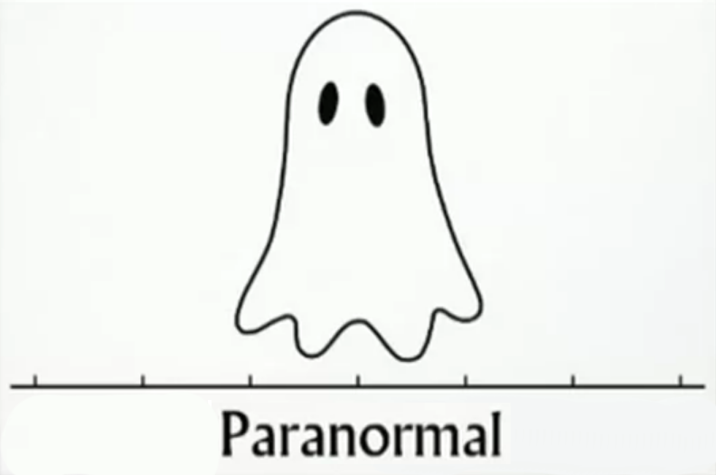

```{r setup, include=FALSE}
knitr::opts_chunk$set(
  echo = TRUE, 
  fig.align = 'center'
)

library(glue)
library(patchwork)
library(latex2exp)

# For nice tables
library(gt)

# For nice dataframe summaries
library(summarytools)
st_options(
  plain.ascii = FALSE,
  dfSummary.varnumbers = FALSE,
  dfSummary.style = 'grid',
  dfSummary.graph.magnif = .75
)

# Tidy!
library(tidyverse)

# Sober theme for ggplot
theme_set(
  theme_linedraw() +                         # Set simple theme for ggplot
    theme(                                   # with some tweaks
      axis.title.y.left = element_text(
         angle = 0,                          # Never rotate y axis title
         margin = margin(r = 20),            # Separate y axis title a little 
         vjust = .5                          # Leave y axis title in the middle
      ),
      axis.title.x.bottom = element_text(
         margin = margin(t = 20)             # Separate x axis title a little 
      ),
      axis.line = element_blank(),           # No axis lines
      panel.border = element_blank(),        # No frame
      panel.grid.minor = element_blank()     # No grid minor lines
    )
)

# Avoid scientific notation and use a comma as decimal separator
options(
  scipen = 15,
  OutDec = ','
)

# Format a number with thousand separators (default point)
# and decimal comma enclosed in curly braces for LaTeX printing.
# CAREFUL: if called outside math mode, will print the braces!
fm <- function(x, big = '.', decimal = '{,}') {
  if (!is.numeric(x)) {
    x
  } else {
    prettyNum(x, big.mark = big, decimal.mark = decimal)
  }

}

set.seed(123)

```

```{js javascript-init, echo=FALSE}

// Make off-site links open in a new window/tab
function changeTargets() {
  $("a").attr(
    "target", function() {
      // Load local links locally
      if (this.host == location.host) return "_self"
      // Load off-site links in a new window
      else return "_blank";
    }
  );
}

// Execute when document is ready
$(
  changeTargets
)
```


```{r histo-funcao, echo=FALSE}
histo <- function(pop) {
  
  pop %>% 
    ggplot(aes(value)) +
      geom_histogram(boundary = 0, bins = 50) +
      labs(
        y = NULL,
        x = 'valor'
      )
  
}
```

```{r tirar-amostra, echo=FALSE}
tirar_amostra <- function(pop, tamanho) {
  
  pop %>% 
    slice_sample(n = tamanho)
  
}
```

```{r func-tcl, echo=FALSE}
demo <- function(
    populacao,         # vetor
    tamanho_amostra,   # dbl
    qtde_amostras      # dbl
  ) {
  
  mu_pop <- mean(populacao)
  sd_pop <- sd(populacao)
  
  cat(
    glue(
      'Média da população         = {mu_pop %>% round(3)}\n',
      'Desvio padrão da população = {sd_pop %>% round(3)}\n\n\n'
    )
  )
  
  populacao <- populacao %>% 
    as_tibble()
  
  amostras <- rerun(
    qtde_amostras, 
    tirar_amostra(populacao, tamanho_amostra)
  )

  medias <- amostras %>% 
    map_dbl(~ mean(pull(., value)))
  
  mu_amostras <- mean(medias)
  sd_amostras <- sd(medias)

  cat(
    glue(
      'Quantidade de amostras     = {qtde_amostras}\n',
      'Tamanho da amostra         = {tamanho_amostra}\n\n\n'
      )
    )

  cat(
    glue(
      'Média das médias amostrais = {mu_amostras %>% round(3)}\n',
      'D.P. das médias amostrais  = {sd_amostras %>% round(3)}\n'
    )
  )
  
  grafico_dist_pop <- populacao %>% 
    as_tibble() %>% 
    histo() + 
      ggtitle('Distribuição da população')
  
  grafico_dist_amostral <- medias %>% 
    as_tibble() %>% 
    histo() + 
      ggtitle('Distribuição das médias amostrais')      

  grafico_dist_pop + grafico_dist_amostral  
  
}
```


# Populações não-normais

## Uniforme

* Dados:

    ```{r tamanho}
    tamanho_populacao <- 1e5
    tamanho_amostra <- 100
    qtde_amostras <- 1e4
    ```
    
* Definimos uma população com valores entre $0$ e $1$:

    ```{r unif, cache=TRUE}
    uniforme <- runif(tamanho_populacao)
    ```

* Vamos retirar muitas amostras desta população e calcular a média de cada amostra.

  * Por exemplo, três amostras e suas respectivas médias:
  
    ```{r}
    a1 <- sample(uniforme, tamanho_amostra)
    a1
    mean(a1)
    
    a2 <- sample(uniforme, tamanho_amostra)
    a2
    mean(a2)

    a3 <- sample(uniforme, tamanho_amostra)
    a3
    mean(a3)
    ```
  
* Teremos, então, um conjunto de médias amostrais. 

  * No nosso exemplo menor, com $3$ amostras:
  
    ```{r}
    medias <- c(mean(a1), mean(a2), mean(a3))
    medias
    ```
  
* Qual é a distribuição destas médias amostrais?

* Qual é a média desta distribuição de médias amostrais?

  * No nosso exemplo menor, com $3$ amostras:
  
    ```{r}
    mean(medias)
    ```

* Qual é o desvio padrão desta distribuição de médias amostrais?

  * No nosso exemplo menor, com $3$ amostras:
  
    ```{r}
    sd(medias)
    ```

* Vamos ver as respostas para o exemplo completo: $`r qtde_amostras %>% fm()`$ amostras de $`r tamanho_amostra %>% fm()`$ elementos cada:

    ```{r demo-unif, cache=TRUE, echo=FALSE}
    demo(uniforme, tamanho_amostra, qtde_amostras)
    ```

* A distribuição da população era uniforme, mas a distribuição [das médias amostrais]{.hl} parece normal!

* A média da distribuição das médias amostrais é próxima da média populacional.

* E o desvio padrão das médias amostrais é função do desvio padrão da população. Na verdade, este desvio padrão é
  
  $$
  \frac{\sigma}{\sqrt{`r tamanho_amostra`}}
  $$
  
  onde $\sigma = `r sd(uniforme) %>% round(3) %>% fm()`$ é o desvio padrão da população, e $`r tamanho_amostra`$ é o tamanho de cada amostra.

::: {.rmdimportant}

### Terminologia {-}

* A distribuição das médias amostrais (o gráfico à direita no exemplo acima) é chamada de [distribuição amostral das médias]{.hl}.

* O desvio padrão da distribuição amostral é chamado de [erro padrão]{.hl}, embora não haja nenhuma idéia de erro aqui.

* A média de todas as médias amostrais é a média populacional. Por incrível que pareça, fica mais fácil entender isto quando escrevemos em matemática:

  $$
  E(\overline X) = \mu
  $$

* Chamamos $\overline X$ de um [estimador não-tendencioso (*unbiased*)]{.hl} de $\mu$. 

:::


## Exponencial

* Dados:

    ```{r tamanho-exp}
    tamanho_populacao <- 1e5
    tamanho_amostra <- 100
    qtde_amostras <- 1e4
    ```
    
* Definimos uma população com $\lambda = 2$:

    ```{r exp, cache=TRUE}
    exponencial <- rexp(tamanho_populacao, 2)
    ```

* Vamos retirar muitas amostras e examinar os resultados:

    ```{r demo-exp, cache=TRUE, echo=FALSE}
    demo(exponencial, tamanho_amostra, qtde_amostras)
    ```

## Uma mistura

* Dados:

    ```{r tamanho-mistura}
    tamanho_populacao <- 1e5
    tamanho_amostra <- 100
    qtde_amostras <- 1e4
    ```
    
* Definimos uma população que é uma mistura de uma binomial com uma Poisson:

    ```{r mistura, cache=TRUE}
    mistura <- c(
      rbinom(tamanho_populacao/2, size = 10, prob = .3),
      rpois(tamanho_populacao/2, lambda = 15)
    )
    ```

* Vamos retirar muitas amostras e examinar os resultados:

    ```{r demo-mistura, cache=TRUE, echo=FALSE}
    demo(mistura, tamanho_amostra, qtde_amostras)
    ```

* Observe que, embora a população tenha uma distribuição discreta, [a distribuição das médias amostrais é sempre contínua.]{.hl}


# Uma população normal

* E se a população já for distribuída normalmente?

* Dados:

    ```{r tamanho-norm}
    tamanho_populacao <- 1e5
    tamanho_amostra <- 100
    qtde_amostras <- 1e4
    ```
    
* Definimos uma população normal padrão ($\mu = 0, \sigma = 1$):

    ```{r norm, cache=TRUE}
    normal <- rnorm(tamanho_populacao)
    ```

* Vamos retirar muitas amostras e examinar os resultados:

    ```{r demo-norm, cache=TRUE, echo=FALSE}
    demo(normal, tamanho_amostra, qtde_amostras)
    ```

# O que isto significa? O TCL

* Em primeiro lugar, que a distribuição normal é mágica! Tão mágica que seu nome deveria ser outro:

{.center width=60%}

* Em segundo lugar, que é possível provar o

::: {.rmdimportant}

### [Teorema Central do Limite (TCL)]{.hl} {-}

* Pense em uma população com distribuição *qualquer*, com média $\mu$ e desvio padrão $\sigma$ ($\mu$ e $\sigma$ finitos). 

* Pense em todas as amostras de tamanho $n$ possíveis, retiradas desta população.

* [As médias de todas estas amostras são valores de uma variável aleatória $\overline X$, e podemos dizer que, quanto maior o valor de $n$:]{.hl}

  * [Mais próxima da distribuição normal é a distribuição de $\overline X$.]{.hl}
  
  * [Mais próximo de $\mu$ é o valor esperado $E(\overline X)$.]{.hl}
  
  * [Mais próximo de $\frac{\sigma}{\sqrt{n}}$ é o desvio padrão de $\overline X$.]{.hl}

* Note que o desvio padrão da distribuição das médias amostrais 

  * Aumenta quando o tamanho da amostra $n$ diminui.
  
  * Diminui quando o tamanho da amostra $n$ aumenta.

:::

## Prova do TCL (parcial)

* Não vamos provar que a distribuição de $\overline X$ é normal --- precisamos de funções geradoras de momentos, um assunto de estatística matemática que não vamos cobrir aqui.

* Mas é fácil provar que $E(\overline X) = \mu$:

  * A média amostral $\overline X$ é uma variável aleatória que é a soma de $n$ variáveis aleatórias $X_1, X_2, \ldots, X_n$ (que representam os elementos de cada amostra) dividida pelo tamanho da amostra, $n$.
  
  * Mais precisamente 
  
    $$
    \overline X = \frac{X_1 + X_2 + \cdots + X_n}{n}
    $$
    
  * Cada uma destas variáveis $X_i$ tem valor esperado $\mu$ (porque cada uma delas vem da população, que tem média $\mu$).
  
  * Em um vídeo anterior, vimos que o valor esperado de uma soma de variáveis aleatórias é a soma dos valores esperados.
  
  * Vimos também que multiplicar a variável por uma constante ($\frac1n$, aqui) multiplica o valor esperado pela mesma constante.
  
  * Então
  
    $$
    \begin{align*}
      E(\overline X) &= E \left(\frac{X_1 + X_2 + \cdots + X_n}{n} \right) \\
                     &= \frac1n \cdot E(X_1 + X_2 + \cdots + X_n) \\
                     &= \frac1n \cdot [E(X_1) + E(X_2) + \cdots + E(X_n)] \\
                     &= \frac1n \cdot [\mu + \mu + \cdots + \mu] \\
                     &= \frac1n \cdot n \cdot \mu \\
                     &= \mu
    \end{align*}
    $$
* Também é fácil provar que o desvio padrão de $\overline X$ é $\frac{\sigma}{\sqrt{n}}$:

  * Vamos pensar sobre a variância.
  
  * Cada uma destas variáveis $X_i$ tem variância $\sigma^2$ (porque cada uma delas vem da população, que tem variância $\sigma^2$).
  
  * A variância da soma de variáveis aleatórias *independentes* é a soma das variâncias.
  
  * Multiplicar a variável por uma constante ($\frac1n$, aqui) multiplica a variância pelo *quadrado* da constante ($\frac1{n^2}$).
  
  * Então:

    $$
    \begin{align*}
      \text{Var}(\overline X) 
      &=  \text{Var}\left(\frac{X_1 + X_2 + \cdots + X_n}{n} \right) \\
      &= \frac1{n^2} \cdot \text{Var}(X_1 + X_2 + \cdots + X_n) \\
      &= \frac1{n^2} \cdot [\text{Var}(X_1) + \text{Var}(X_2) + \cdots + \text{Var}(X_n)] \\
      &= \frac1{n^2} \cdot [\sigma^2 + \sigma^2 + \cdots + \sigma^2] \\
      &= \frac1{n^2} \cdot n \cdot \sigma^2 \\
      &= \frac{\sigma^2}{n}
    \end{align*}
    $$

  * Como o desvio padrão é a raiz quadrada da variância, o desvio padrão de $\overline X$ é $\sqrt{\frac{\sigma^2}{n}} = \frac{\sigma}{\sqrt{n}}$, onde $\sigma$ é o desvio padrão da população.
  

# Proporções

* O TCL fala de *médias*, mas também serve para *proporções*.

* Exemplo: de uma população de $1.000$ pessoas, você extrai uma amostra de $100$ pessoas e calcula a proporção $\hat p$ de fumantes na amostra. O que o TCL diz sobre $\hat p$?

* $\hat p$ é o número $k$ de fumantes na amostra, dividido pelo tamanho da amostra $n$:

  $$
  \hat p = \frac kn
  $$

* Mas isto também pode ser calculado da seguinte forma:

  1. Represente cada pessoa da amostra por $0$ ou por $1$, dependendo de se ela é não-fumante ou fumante, respectivamente. Isto equivale a definir $n$ variáveis aleatórias $X_1, X_2, \ldots, X_n$, tais que
  
     $$
     X_i = \begin{cases}
       0 & \text{se a pessoa } i \text{ é não-fumante}\\
       1 & \text{se a pessoa } i \text{ é fumante}
     \end{cases}
     $$

     Em R, guarde todos estes $0$s e $1$s em um vetor `X`.

  2. O número de fumantes na amostra vai ser $\sum X_i$, ou, em R, `sum(X)`.
  
  3. Se você dividir esta soma por $n$, você terá a média de todas as variáveis $X_i$, que é exatamente a proporção de fumantes na amostra. Em R, `mean(X)`.
  
     $$
     \hat p = \frac{\sum X_i}{n}
     $$

  4. Conclusão: a proporção também é uma média, e também obedece ao TCL.

* O TCL diz que a distribuição amostral de $\hat p$ é normal.

* O TCL diz que o valor esperado de $\hat p$ é a proporção $p$ de fumantes *na população*. Ou seja, se você retirar muitas amostras de $n$ pessoas, a média das proporções amostrais vai ser a proporção populacional. 

  $$
  E(\hat p) = p
  $$

  Usando a terminologia que já vimos, [$\hat p$ é um estimador não-tendencioso de $p$.]{.hl}

* Para calcular o desvio padrão, pense que uma proporção tem tudo a ver com uma variável aleatória *binomial* $Y = {}$ número de fumantes (sucessos) em uma amostra de $n$ pessoas ($n$ provas de Bernoulli), onde cada pessoa tem probabilidade $\hat p$ de ser fumante ($\hat p$ é a proporção de fumantes na amostra).

* Por este raciocínio, a proporção amostral é $\frac Yn$.

* Da aula sobre variáveis aleatórias discretas, você lembra que $Y$ tem variância $n\hat p (1 - \hat p)$ e, daí, desvio padrão $\sqrt{\hat p (1 - \hat p)}$.

* O TCL diz que [o desvio padrão da distribuição amostral de $\hat p$ vai ser]{.hl}

  $$
  \frac{\sqrt{\hat p (1 - \hat p)}}{\sqrt{n}} 
  \quad=\quad 
  \sqrt{\frac{\hat p (1 - \hat p)}{n}}
  $$

* Vamos fazer uma simulação:

    ```{r}
    tamanho_populacao <- 1e3
    tamanho_amostra <- 100
    qtde_amostras <- 1e4
    proporcao_pop <- .3
    
    populacao <- sample(
      0:1, 
      tamanho_populacao, 
      replace = TRUE, 
      prob = c(1 - proporcao_pop, proporcao_pop)
    )
    ```

    ```{r cache=TRUE, echo=FALSE}
    demo(
      populacao,
      tamanho_amostra, 
      qtde_amostras 
    )    
    
    ```


# Condições para usar o TCL na prática

Quando você obtém uma amostra de uma população, você deve observar as seguintes condições:

* O tamanho $n$ da amostra deve ser *grande o bastante*. [Na prática, $n \geq 30$ é razoável.]{.hl}

* Quando a amostra vem de uma população com distribuição normal, o tamanho da amostra pode ser menor ($n \geq 10$).

* Os indivíduos da amostra devem ser *independentes entre si*. Na teoria, a população deveria ser infinita, e as amostras, aleatórias. 

  * Na prática, basta a população ser grande o bastante em relação ao tamanho da amostra. [Geralmente, *$n$ não deve ultrapassar $10\%$ do tamanho da população*.]{.hl}

  * [Na prática, quanto mais randomizada for a amostra, melhor.]{.hl}
  
* No caso de proporções, uma amostra com uma quantidade potencial muito grande ou muito pequena de sucessos vai acabar gerando uma distribuição amostral não-normal. [Na prática, sua amostra deve ter, potencialmente, pelo menos $10$ sucessos e pelo menos $10$ fracassos.]{.hl}

# Mais exemplos [^dv] 

[^dv]: Adaptados de https://media.pearsoncmg.com/aw/aw_deveaux_stats_4_2016/websites/statdm4d_comp_web_launch.html

## Canhotos 

::: {.rmdbox}

* Suponha que $13\%$ da população sejam de pessoas canhotas.

* Uma sala de aula tem $200$ carteiras, com $15$ carteiras especiais para alunos canhotos.

* Em uma turma de $90$ alunos, qual a probabilidade de que estas carteiras especiais não sejam suficientes para os alunos canhotos?

:::

### Resposta {-}

* A pergunta é: em uma amostra com $n = 90$ alunos, qual a probabilidade de haver mais de $15$ alunos canhotos?

* Traduzindo para proporção: qual a probabilidade de $\hat p$ (a proporção de canhotos na amostra) ser maior que $\frac{15}{90} = 0{,}167$?

* Ou seja, queremos achar $\Pr(\hat p > 0{,}167)$.

* A proporção populacional $p$ é $0{,}13$.

* Vamos verificar as condições para usar o TCL:

  1. O tamanho da amostra é grande o bastante? Sim, $n = 90$.
  
  1. O tamanho da amostra é menos que $10\%$ da população? Ninguém nos disse qual é a população. Vamos supor que a população é o conjunto de todos os alunos da cidade, e que a cidade tem mais de $900$ alunos; então esta condição está satisfeita.
  
  1. Os indivíduos são independentes entre si? Podemos supor que sim: um aluno ser canhoto não afeta a probabilidade de outro aluno ser canhoto (a não ser que se trate de uma escola especial para canhotos ou que todos os alunos sejam clones).
  
  1. A amostra é aleatória? Só podemos responder se soubermos como os $90$ alunos foram escolhidos. Vamos supor que sim.
  
  1. Existem potencialmente mais de $10$ sucessos e mais de $10$ fracassos na amostra? Sim, potencialmente, são $90 \cdot 0{,}13 = 11{,}7$ canhotos e $90 \cdot 0{,}87 = 78{,}3$ destros.
  
* A distribuição amostral de $\hat p$, segundo o TCL, vai ser a normal com média
  
  $$
  p = 0{,}13
  $$
  
  e erro padrão (lembre-se de que este é o nome do desvio padrão da distribuição amostral)
  
  $$
  \sqrt{\frac{p(1-p)}{n}} 
  \quad=\quad 
  \sqrt{\frac{0{,}13\cdot 0{,}87}{90}}
  \quad\approx\quad
  0{,}035
  $$

* Ou seja, $\hat p \sim \mathcal N (0{,}13; 0{,}035)$, e nós queremos $\Pr(\hat p > 0{,}167)$. Basta usar o R:

    ```{r}
    pnorm(q = .167, mean = .13, sd = .035, lower.tail = FALSE)
    ```

* Conclusão: existe uma chance de aproximadamente $14{,}5\%$ de que as carteiras especiais para canhotos não sejam suficientes para uma turma de $90$ alunos.

* E se a turma for de $200$ alunos, lotando a sala?

## Elevador

::: {.rmdbox}

* O peso de um homem adulto é distribuído normalmente, com média de $86$kg e desvio padrão de $26{,}8$kg.

* O limite de peso de um elevador é de $10$ pessoas ou $1.100$kg.

* Qual a probabilidade de que $10$ homens entrem no elevador e excedam o limite de peso?

:::

### Resposta

* Para os $10$ homens excederem o limite de peso, o total dos seus pesos deve ultrapassar $1.100$kg, o que equivale a dizer que o peso médio deve ultrapassar $1.100 / 10 = 110$kg.

* A pergunta, então, é: qual a probabilidade $\Pr(\overline X \geq 110)$?

* Vamos verificar as condições para usar o TCL:

  1. O tamanho da amostra é grande o bastante? Como, na população, o peso tem distribuição normal, $n = 10$ está OK.
  
  1. O tamanho da amostra é menos que $10\%$ da população? De novo, ninguém nos disse qual é a população. Vamos supor que a população é o conjunto de todos os homens da cidade. Então, $n = 10$ é menos do que $10\%$ da população.
  
  1. Os indivíduos são independentes entre si? Podemos supor que sim. Os homens não são todos parentes, não são todos faquires, nem são todos lutadores de sumô.
  
  1. A amostra é aleatória? Vamos supor que sim. O elevador não está numa clínica de emagrecimento. O conjunto de homens é escolhido ao acaso na população geral.
  
* A distribuição amostral de $\overline X$, segundo o TCL, vai ser a normal com média
  
  $$
  \mu = 86
  $$
  
  e erro padrão (lembre-se de que este é o nome do desvio padrão da distribuição amostral)
  
  $$
  \frac{\sigma}{\sqrt{n}}
  \quad=\quad 
  \frac{26{,}8}{\sqrt{10}}
  \quad\approx\quad
  8{,}47
  $$

* Ou seja, $\overline X \sim \mathcal N (86; 8{,}47)$, e nós queremos $\Pr(\overline X \geq 110)$. Basta usar o R:

    ```{r}
    pnorm(q = 110, mean = 86, sd = 8.47, lower.tail = FALSE)
    ```

* Conclusão: existe uma probabilidade muito pequena --- $0{,}2\%$ --- de que uma amostra de $10$ homens exceda o limite de peso do elevador.


<div style='height: 1000px;'></div>
