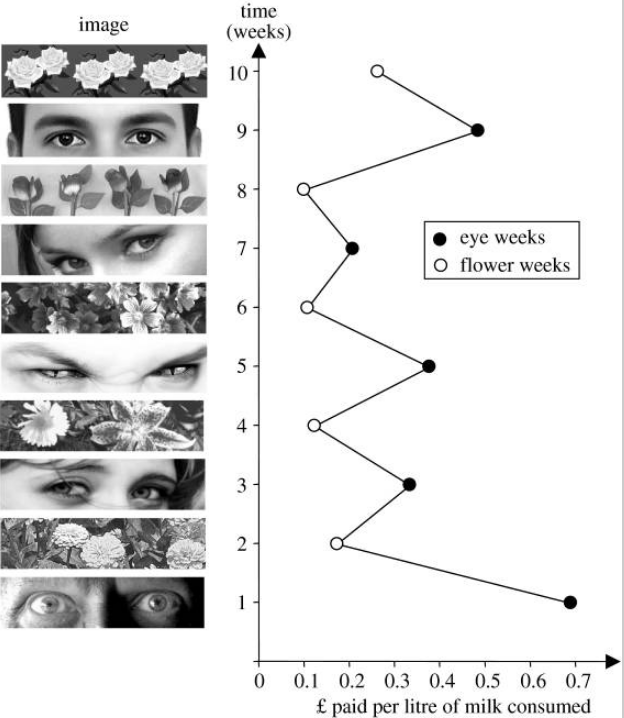

```{r setup, include=FALSE}
library(knitr)

opts_chunk$set(
  echo = TRUE, 
  # collapse = TRUE,
  # cache = TRUE,
  out.width = "75%",
  fig.align = 'center',
  fig.width = 6,
  fig.show = "hold"
)

options(dplyr.print_min = 6, dplyr.print_max = 6)

# Supress crayon output
options(crayon.enabled = FALSE)

# Useful libraries
library(glue)
library(patchwork)
library(latex2exp)
library(kableExtra)

# For nice dataframe summaries
library(summarytools)
st_options(
  plain.ascii = FALSE,
  dfSummary.varnumbers = FALSE,
  dfSummary.style = 'grid',
  dfSummary.graph.magnif = .75
)

# Tidy!
library(tidyverse)

# Sober theme for ggplot
theme_set(
  theme_linedraw() +                         # Set simple theme for ggplot
    theme(                                   # with some tweaks
      axis.title.y.left = element_text(
         angle = 0,                          # Never rotate y axis title
         margin = margin(r = 20),            # Separate y axis title a little 
         vjust = .5                          # Leave y axis title in the middle
      ),
      axis.title.x.bottom = element_text(
         margin = margin(t = 20)             # Separate x axis title a little 
      ),
      axis.line = element_blank(),           # No axis lines
      panel.border = element_blank(),        # No frame
      panel.grid.minor = element_blank()     # No grid minor lines
    )
)

# Avoid scientific notation and use a comma as decimal separator
options(
  scipen = 15,
  OutDec = ','
)

# Format a number with thousand separators (default point)
# and decimal comma enclosed in curly braces for LaTeX printing.
# CAREFUL: if called outside math mode, will print the braces!
fm <- function(x, big = '.', decimal = '{,}', ...) {
  if (!is.numeric(x)) {
    x
  } else {
    prettyNum(x, big.mark = big, decimal.mark = decimal, ...)
  }

}

# Set this as a hook for inline R code
knitr::knit_hooks$set(inline = fm)


# To center the results of a chunk (image, video etc.)
# Usage: 
#         out.extra=center()
#         
center <- function(){
  
  if (is_html_output()) {
    'class="center"'
  }
  
}


# To embed YT videos in HTML and the link (centered) in LaTeX
embed_yt <- function(code) {

  if (is_html_output()) {
    include_url(
      paste0(
        'https://www.youtube.com/embed/',
        code
      )
    )
  } else {
    cat(
      paste0(
        '```{=latex}\n',
        '\\begin{center} \\url{https://youtu.be/',
        code,
        '} \\end{center}\n',
        '```'
      )
    )
  }
  
}

```

```{js javascript-init, echo=FALSE}

// Make off-site links open in a new window/tab
function changeTargets() {
  $("a").attr(
    "target", function() {
      // Load local links locally
      if (this.host == location.host) return "_self"
      // Load off-site links in a new window
      else return "_blank";
    }
  );
}

// Execute when document is ready
$(
  changeTargets
)
```


# Diferença entre proporções

## Exemplo: jovens *online*

::: {.rmdbox}

Duas amostras: 

* $141$ de $248$ rapazes com idades entre $15$ e $17$ anos possuem um perfil *online*.

* $179$ de $256$ meninas com idades entre $15$ e $17$ anos possuem um perfil *online*.

A diferença entre as proporções é significativa?

:::

### Condições {-}

* As [mesmas condições de testes com uma amostra]{.hl} precisam ser verificadas:

  * Independência.
  
  * Amostras aleatórias e representativas.
  
  * Tamanho da amostra menor que $10\%$ da população.
  
* [E mais:]{.hl}
  
  * Independência dos grupos.
  
  * Cada grupo deve ter no mínimo $10$ sucessos e $10$ fracassos.
  
### Hipóteses {-}  

* O teste, agora, é sobre a [diferença]{.hl} entre as proporções:

  $$
  H_0 : p_h - p_m = 0 \\
  H_A : p_h - p_m \neq 0
  $$

### Erro padrão {-}

* A diferença $p_h - p_m$ é uma variável aleatória.

* A variância da diferença é a soma das variâncias:

  $$
  \sigma^2_{p_h - p_m} = \sigma^2_{p_h} + \sigma^2_{p_m}
  $$

* A variância da proporção [amostral]{.hl} é

  $$
  \sigma^2(\hat p) = \frac{p(1 - p)}{n}
  $$

* Logo, a variância da diferença $p_h - p_m$ será

  $$
  \sigma^2(\hat p_h - \hat p_m) 
  = \frac{p_h(1 - p_h)}{n_h} + \frac{p_m(1 - p_m)}{n_m}
  $$

* Daí, o desvio padrão da distribuição amostral da diferença é

  $$
  \sigma(\hat p_h - \hat p_m) 
  = \sqrt{\frac{p_h(1 - p_h)}{n_h} + \frac{p_m(1 - p_m)}{n_m}}
  $$

* Como não sabemos os valores verdadeiros de $p_h$ e $p_m$, usamos as proporções amostrais para obter o erro padrão:

  $$
  EP(\hat p_h - \hat p_m) 
  = \sqrt{\frac{\hat p_h(1 - \hat p_h)}{n_h} + \frac{\hat p_m(1 - \hat p_m)}{n_m}}
  $$

* [Se fôssemos construir um intervalo de confiança]{.hl}, usaríamos este erro padrão.

* Mas, em um teste de hipóteses, [estamos supondo que $H_0$ é verdadeira, o que equivale a dizer que $p_h = p_m$.]{.hl}

* Então, podemos calcular uma [proporção ponderada, ou agregada:]{.hl}

  $$
  \bar p = \frac{\text{sucessos}_h + \text{sucessos}_m}{n_h + n_m}
  $$

* Aí, [calculamos o erro padrão com este valor]{.hl} em vez de $\hat p_h$ e $\hat p_m$:
  
  $$
  EP(\hat p_h - \hat p_m) 
  = \sqrt{\frac{\bar p(1 - \bar p)}{n_h} + \frac{\bar p(1 - \bar p)}{n_m}}
  $$


### Valores {-}

* Tamanhos das amostras: $n_h = 248$ e $n_m = 256$.

* Proporções amostrais: $\hat p_h = 0{,}57$ e $\hat p_m = 0{,}7$.

* Hipótese de nulidade: $H_0 : p_h - p_m = 0$.

* Hipótese alternativa: $H_A : p_h - p_m \neq 0$.

* Nível de significância: $\alpha = 0{,}05$.


### Cálculos {-}

```{r}
n_h <- 248
sucessos_h <- 141
p_h <- sucessos_h / n_h

n_m <- 256
sucessos_m <- 179
p_m <- sucessos_m / n_m

d0 <- 0
d_chapeu <- p_m - p_h 
d_cauda_esquerda <- d0 - (d_chapeu - d0)

p_agregado <- (sucessos_h + sucessos_m) / (n_h + n_m)

ep <- sqrt(
  p_agregado * (1 - p_agregado) / n_h + 
  p_agregado * (1 - p_agregado) / n_m
)

ep
```

### A distribuição amostral de $\hat p_h - \hat p_m$, supondo $H_0$ {-}

```{r echo=FALSE}
d_min <- -.15
d_max <- .15

brks <- c(d_min, d_cauda_esquerda, d0, d_chapeu, d_max) %>% round(2)

ggplot() +
  stat_function(
    fun = dnorm,
    args = c(d0, ep),
    xlim = c(d_min, d_max)
  ) +
  stat_function(
    fun = dnorm,
    args = c(d0, ep),
    xlim = c(d_min, d_cauda_esquerda),
    fill = 'red',
    alpha = .5,
    geom = 'area'
  ) +
  stat_function(
    fun = dnorm,
    args = c(d0, ep),
    xlim = c(d_chapeu, d_max),
    fill = 'red',
    alpha = .5,
    geom = 'area'
  ) +
  scale_x_continuous(
    breaks = brks
  ) +
  labs(
    y = NULL
  )
```

### Valor $p$ e conclusão {-}

```{r}
valor_p <- 
  pnorm(d_cauda_esquerda, mean = d0, sd = ep) +
  pnorm(d_chapeu, mean = d0, sd = ep, lower.tail = FALSE)
valor_p
```

* Este valor é [menor]{.hl} do que $\alpha = 0{,}05$. Logo, nossa amostra é evidência para [rejeitar]{.hl} a hipótese de nulidade neste nível de significância.


## Em R

```{r}
prop.test(
  x = c(sucessos_m, sucessos_h),
  n = c(n_m, n_h),
  alternative = 'two.sided',
  correct = FALSE
)
```


# Diferença entre médias (amostras independentes)

## Exemplo: olhos $\times$ flores

::: {.rmdbox}

* Em $2006$, pesquisadores em uma universidade inglesa fizeram um experimento para verificar se as pessoas alteram seu comportamento quando se sentem vigiadas. 

* Na universidade, havia uma copa onde chá, café e leite eram disponibilizados para todos que frequentavam o local.

* Na parede, próximo às bebidas, ficava um cartaz com as instruções para pagamento e os valores de cada bebida. As pessoas deviam depositar o dinheiro em uma caixa próxima às bebidas.

* Junto a esse cartaz, os pesquisadores afixaram outro, com imagens.

* As imagens eram trocadas regularmente. Durante uma semana, eram flores; durante uma semana, era um par de olhos. Esta alternância foi mantida durante $10$ semanas.

* A disposição da copa era tal que, se alguém decidisse não pagar, ninguém perceberia.

* Os pesquisadores controlaram a arrecadação por litro de leite consumido por semana.

* Em média, esta arrecadação foi quase $3$ vezes maior nas semanas em que o cartaz continha o par de olhos, em comparação com as semanas em que o cartaz continha as flores:

{ style='width: 50%;' .center }

* Este exemplo é baseado em https://www.ncbi.nlm.nih.gov/pmc/articles/PMC1686213/, de onde foi retirada a imagem acima.

:::


### Amostras {-}

* As $5$ semanas com os cartazes dos olhos formam uma amostra.

* Nessas semanas, a arrecadação média por litro de leite foi de $0{,}417$ libras, com desvio padrão de $0{,}1811$.

* As $5$ semanas com os cartazes das flores formam a outra amostra.

* Nessas semanas, a arrecadação média por litro de leite foi de $0{,}151$ libras, com desvio padrão de $0{,}067$.

* Em R:

    ```{r}
    amostra_1 <- c(0.6843, 0.3038, 0.3780, 0.2202, 0.4987)
    amostra_2 <- c(0.1737, 0.117, 0.1075, 0.0981, 0.2587)
    ```


### Condições {-}

* [Independência:]{.hl} vamos supor que as contribuições de uma pessoa são independentes das das outras.

* [Amostras aleatórias e representativas:]{.hl} vamos supor que essas contribuições representam a população de interesse (contribuições de frequentadores e funcionários da universidade? de todos os cidadãos ingleses? de toda a humanidade?)

* [Tamanho das amostras:]{.hl}

  * As amostras são menos do que $10\%$ da população.
  
  * As amostras são pequenas ($n_1 = n_2 = 5$). Precisamos ser cautelosos quanto às conclusões.
  
* [Independência dos grupos:]{.hl} o comportamento das pessoas nas semanas dos olhos é independente do comportamento *das mesmas pessoas* nas semanas das flores? Vamos supor que sim, embora esta seja uma suposição arriscada.

* [Dados aproximadamente normais:]{.hl} com amostras tão pequenas, é difícil avaliar. 

  * Para as semanas dos olhos:

    ```{r echo=FALSE}
    amostra_1 %>% 
      as_tibble() %>% 
      ggplot(aes(value)) +
        geom_histogram(bins = 4) +
        scale_y_continuous(breaks = 0:2) + 
        labs(
          y = NULL,
          x = 'arrecadação'
        )
    ```

  * Para as semanas das flores:

    ```{r echo=FALSE}
    amostra_2 %>% 
      as_tibble() %>% 
      ggplot(aes(value)) +
        geom_histogram(bins = 3) +
        labs(
          y = NULL,
          x = 'arrecadação'
        )
    ```

  * Agregando as duas amostras:

    ```{r echo=FALSE}
    c(amostra_1, amostra_2) %>% 
      as_tibble() %>% 
      ggplot(aes(value)) +
        geom_histogram(bins = 3) +
        labs(
          y = NULL,
          x = 'arrecadação'
        )
    ```

  * Pelo menos o terceiro histograma (com a união das duas amostras) é unimodal e simétrico. Vamos prosseguir com cautela.


### Hipóteses {-}

* O teste, agora, é sobre a [diferença entre as médias]{.hl}:

  $$
  H_0 : \mu_1 - \mu_2 = 0 \\
  H_A : \mu_1 - \mu_2 \neq 0
  $$

  onde $\mu_1$ é a média da arrecadação nas semanas dos olhos, e $\mu_2$ é a média da arrecadação nas semanas das flores.


### Erro padrão (variâncias diferentes) {-}

* Mesmo quando supomos $H_0$ --- i.e., que as médias [populacionais]{.hl} $\mu_1$ e $\mu_2$ são iguais --- não podemos afirmar nada sobre os desvios padrão das duas [subpopulações]{.hl}: as semanas dos olhos e as semanas das flores.

* Podemos estimar as variações das duas amostras criando um *boxplot*:

    ```{r echo=FALSE}
    tibble(
      valor = c(amostra_1, amostra_2),
      amostra = factor(
        rep(c(1, 2), c(length(amostra_1), length(amostra_2)))
      )
    ) %>% 
      ggplot() +
        geom_boxplot(aes(group = amostra, y = valor, fill = amostra)) +
        scale_x_continuous(breaks = NULL) +
        scale_y_continuous(limits = c(0, NA)) +
        labs(
          x = NULL,
          y = NULL
        )
    ```

  A amostra $1$ parece ter uma variação maior do que a amostra $2$.
  
* De fato, o desvio padrão da amostra $1$ é quase o triplo do da amostra $2$.

    ```{r}
    sd(amostra_1)
    sd(amostra_2)
    ```

* Então, estimamos a variância das semanas dos olhos por

  $$
  \hat \sigma^2_1 = \frac{s^2_1}{n_1}
  $$

  e estimamos a variância das semanas das flores por

  $$
  \hat \sigma^2_2 = \frac{s^2_2}{n_2}
  $$

* Daí, supondo $H_0$, a estimativa da variância populacional é

  $$
  \hat \sigma^2 = \frac{s^2_1}{n_1} + \frac{s^2_2}{n_2}
  $$

* E o erro padrão será

  $$
  EP = \sqrt{\frac{s^2_1}{n_1} + \frac{s^2_2}{n_2}}
  $$


### Valores {-}

* Tamanhos das amostras: $n_1 = n_2 = 5$.

* Médias amostrais: $\bar x_1 = 0{,}417$ e $\bar x_2 = 0{,}151$.

* Desvios padrão amostrais: $s_1 = 0{,}1811$ e $s_2 = 0{,}067$.

* Hipótese de nulidade: $H_0 : \mu_1 - \mu_2 = 0$.

* Hipótese alternativa: $H_A : \mu_1 - \mu_2 \neq 0$.

* Nível de significância: $\alpha = 0{,}05$.


### Cálculos {-}

```{r}
n_1 <- length(amostra_1)
xbarra_1 <- mean(amostra_1)
s_1 <- sd(amostra_1)

n_2 <- length(amostra_2)
xbarra_2 <- mean(amostra_2)
s_2 <- sd(amostra_2)

d0 <- 0
dx <- xbarra_1 - xbarra_2
d_cauda_esquerda <- d0 - dx
  
ep <- sqrt(s_1^2 / n_1 + s_2^2 / n_2)
ep
```


### A distribuição amostral de $\bar x_1 - \bar x_2$, supondo $H_0$ {-}

* Como não sabemos o desvio padrão [populacional]{.hl}, precisamos usar a distribuição $t$.

* A média da distribuição $t$ é $0$. Precisamos padronizar os valores:

    ```{r}
    dx
    ```

    ```{r}
    tx <- (dx - d0)/ep
    tx
    ```

    ```{r}
    t_cauda_esquerda <- (d_cauda_esquerda - d0)/ep
    ```

* Quantos graus de liberdade?

  O número de graus de liberdade é dado por
  
  $$
  \nu = \frac{
    \left( \frac{s_1^2}{n_1} + \frac{s_2^2}{n_2} \right)^2
  }{
    \frac{(s_1^2 / n_1)^2}{n_1 - 1} +
    \frac{(s_2^2 / n_2)^2}{n_2 - 1}
  }
  $$

    ```{r}
    gl <- (s_1^2 / n_1 + s_2^2 / n_2)^2 / (
      (s_1^2 / n_1)^2 / (n_1 - 1) +
      (s_2^2 / n_2)^2 / (n_2 - 1)
    )
    
    gl
    ```

* Graficamente:

    ```{r echo=FALSE}
    d_min <- -5
    d_max <- 5
    
    brks <- c(d_min, t_cauda_esquerda, 0, tx, d_max) %>% round(2)
    
    ggplot() +
      stat_function(
        fun = dt,
        args = gl,
        xlim = c(d_min, d_max)
      ) +
      stat_function(
        fun = dt,
        args = gl,
        xlim = c(d_min, t_cauda_esquerda),
        fill = 'red',
        alpha = .5,
        geom = 'area'
      ) +
      stat_function(
        fun = dt,
        args = gl,
        xlim = c(tx, d_max),
        fill = 'red',
        alpha = .5,
        geom = 'area'
      ) +
      scale_x_continuous(
        breaks = brks
      ) +
      labs(
        y = NULL
      )
    ```


### Valor $p$ e conclusão {-}

```{r}
valor_p <- 
  pt(t_cauda_esquerda, gl) +
  pt(tx, gl, lower.tail = FALSE)

valor_p
```

* Este valor é [menor]{.hl} do que $\alpha = 0{,}05$. Logo, nossa amostra é evidência para [rejeitar]{.hl} a hipótese de nulidade neste nível de significância.


## Em R

```{r}
t.test(amostra_1, amostra_2)
```

## E se as arrecadações médias tiverem o mesmo $\sigma$?

* O cálculo do erro padrão muda.

* A variância agregada é

  $$
  s^2 = \frac{(n_1 - 1)s_1^2}{(n_1 + n_2 - 2)} + 
    \frac{(n_2 - 1)s_2^2}{(n_1 + n_2 - 2)}
  $$
  
* O erro padrão fica

  $$
  EP = \sqrt{\frac{s^2}{n_1} + \frac{s^2}{n_2}}
  $$
  
  onde $s^2$ é a variância agregada, calculada acima.
  
    ```{r}
    var_agregada <- (
      (n_1 - 1) * var(amostra_1) + (n_2 - 1) * var(amostra_2)
    ) / (n_1 + n_2 - 2)
    
    ep <- sqrt(var_agregada / n_1 + var_agregada / n_2)
    ep
    ```

* O número de graus de liberdade fica mais simples:

    ```{r}
    gl <- n_1 + n_2 - 2
    gl
    ```

* Refazendo os cálculos:

    ```{r}
    tx <- (dx - d0)/ep
    tx
    ```

    ```{r}
    t_cauda_esquerda <- (d_cauda_esquerda - d0)/ep
    
    valor_p <- 
      pt(t_cauda_esquerda, gl) +
      pt(tx, gl, lower.tail = FALSE)
    
    valor_p
    ```

* Supondo o mesmo desvio padrão para as duas subpopulações, o valor $p$ fica ainda menor. Como o valor é [menor]{.hl} do que $\alpha = 0{,}05$, nossa amostra é evidência para [rejeitar]{.hl} a hipótese de nulidade neste nível de significância.

* Em R:

    ```{r}
    t.test(amostra_1, amostra_2, var.equal = TRUE)
    ```


# Diferença entre médias (amostras pareadas)

## Exemplo: quilometragem

```{r echo=FALSE}
  df <- tibble(
    motorista = 1:11,
    dias_5 = c(2798, 7724, 7505,  838, 4592, 8107, 1228, 8718, 1097, 8089, 3807),
    dias_4 = c(2914, 6112, 6177, 1102, 3281, 4997, 1695, 6606, 1063, 6392, 3362),
    diferença = dias_5 - dias_4
  )
```

::: {.rmdbox}

* Durante um ano, um órgão público mediu a quilometragem total de seus $11$ motoristas em um regime de trabalho de $5$ dias por semana.

* No ano seguinte, os mesmos $11$ motoristas trabalharam $4$ dias por semana, e as quilometragens totais foram medidas novamente.

* Os resultados foram:

  ```{r echo=FALSE}
  df
  ```

* A diferença nas quilometragens foi significativa?

* Exemplo baseado em https://www.thefreelibrary.com/Four-day+work+week+improves+environment.-a019280161

:::

* As amostras agora são [pareadas]{.hl}.

* O que nos interessa é a diferença na quilometragem [de cada motorista]{.hl}.

* Vamos fazer um [teste $t$ sobre as diferenças]{.hl} (os valores da última coluna).


### Condições

* [Independência entre os pares:]{.hl} o comportamento de cada motorista independe do comportamento dos outros.

* [Amostras aleatórias e representativas:]{.hl} vamos supor que sim.

* [Tamanho das amostras:]{.hl} as amostras são menos do que $10\%$ da população.
  
* [Dados aproximadamente normais:]{.hl} vejamos um histograma das diferenças:

    ```{r echo=FALSE}
    df %>% 
      ggplot(aes(diferença)) +
        geom_histogram(breaks = seq(-2000, 4000, 2000)) +
        labs(y = NULL)
    ```


### Hipóteses

* O teste, agora, é sobre a [média das diferenças]{.hl}:

  $$
  H_0 : \mu_d = 0 \\
  H_A : \mu_d \neq 0
  $$


### Erro padrão

* Como o erro padrão de $\mu$, mas, aqui, [$n$ é o número de pares.]{.hl}

  $$
  EP = \frac{s_d}{\sqrt n}
  $$

  onde $s_d$ é o desvio padrão das diferenças.
  

### Valores

* Tamanho da amostra: $n = 11$.

* Média amostral: $\bar d = `r mean(df$diferença)`$.

* Desvio padrão amostral: $s_d = `r sd(df$diferença)`$.

* Hipótese de nulidade: $H_0 : \mu_d = 0$.

* Hipótese alternativa: $H_A : \mu_d \neq 0$.

* Nível de significância: $\alpha = 0{,}05$.


### Cálculos

```{r}
n <- length(df$diferença)
d_barra <- mean(df$diferença)
s_d <- sd(df$diferença)

d0 <- 0
  
ep <- s_d / sqrt(n)
ep
```


### A distribuição amostral de $\bar d$

* Como não sabemos o desvio padrão [populacional]{.hl}, precisamos usar a distribuição $t$.

* A média da distribuição $t$ é $0$. Precisamos padronizar os valores:

    ```{r}
    d_barra
    ```

    ```{r}
    t_barra <- (d_barra - d0)/ep
    t_barra
    ```

* O número de graus de liberdade é $n - 1 = `r n - 1`$.

    ```{r}
    gl <- n - 1
    ```

  
* Graficamente:

    ```{r echo=FALSE}
    d_min <- -4
    d_max <- 4
    
    t_cauda_esquerda <- -t_barra
    
    brks <- c(d_min, t_cauda_esquerda, 0, t_barra, d_max) %>% round(2)
    
    ggplot() +
      stat_function(
        fun = dt,
        args = gl,
        xlim = c(d_min, d_max)
      ) +
      stat_function(
        fun = dt,
        args = gl,
        xlim = c(d_min, t_cauda_esquerda),
        fill = 'red',
        alpha = .5,
        geom = 'area'
      ) +
      stat_function(
        fun = dt,
        args = gl,
        xlim = c(t_barra, d_max),
        fill = 'red',
        alpha = .5,
        geom = 'area'
      ) +
      scale_x_continuous(
        breaks = brks
      ) +
      labs(
        y = NULL
      )
    ```


### Valor $p$ e conclusão

```{r}
valor_p <- 2 * pt(t_barra, gl, lower.tail = FALSE)
valor_p
```

* Este valor é [menor]{.hl} do que $\alpha = 0{,}05$, nossa amostra é evidência para [rejeitar]{.hl} a hipótese de nulidade neste nível de significância. A quilometragem média variou de um ano para o outro.


## Em R

```{r}
t.test(
  df$dias_5, 
  df$dias_4,
  paired = TRUE
)
```


# Outros testes em R

::: {.rmdimportant}

Diversas outras funções em R apresentam os resultados de testes em termos de intervalos de confiança e/ou valores $p$.

:::

## Teste de normalidade de Shapiro-Wilk

* [A hipótese de nulidade é $H_0: {}$ a amostra vem de uma distribuição normal.]{.hl}

* Então, um valor $p$ alto é evidência a favor da normalidade dos dados:

    ```{r}
    x <- rnorm(100, 5, 3)
    shapiro.test(x)
    ```

    ```{r}
    x <- runif(100, 0, 1)
    shapiro.test(x)
    ```


## Teste para comparar variâncias

* [A hipótese de nulidade é $H_0 : \sigma^2_x / \sigma^2_y = r$, onde o valor *default* de $r$ é $1$.]{.hl}

* Testando as amostras do experimento olhos $\times$ flores:

    ```{r}
    var.test(amostra_1, amostra_2)
    ```


## Teste de correlação

* [A hipótese de nulidade é $H_0 : {}$ as variáveis (pareadas) $x$ e $y$ *não* são correlacionadas.]{.hl}

* Testando as amostras do exemplo dos motoristas:

    ```{r}
    cor.test(df$dias_4, df$dias_5)
    ```


<div style='height: 1000px'></div>

