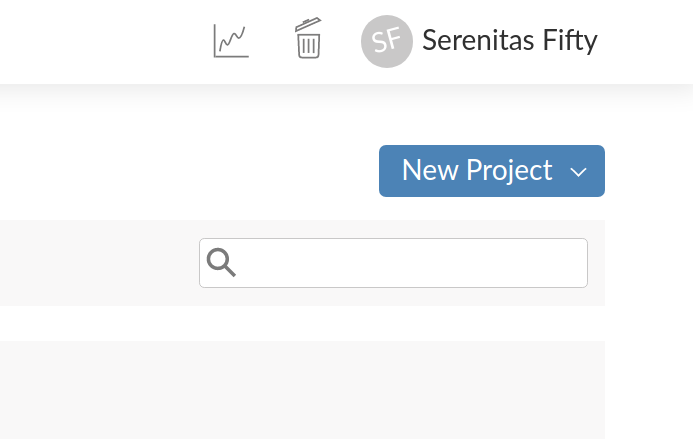
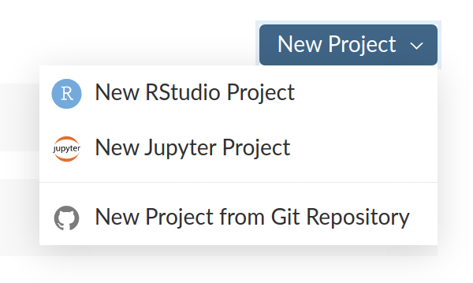

<!-- README.md is generated from README.Rmd. Please edit that file -->

```{r, include = FALSE}
knitr::opts_chunk$set(
  collapse = TRUE,
  comment = "#>"
)
```

# CursoProbEst

<!-- badges: start -->
<!-- badges: end -->


## Descrição

Este repositório contém todos os arquivos usados no meu curso de Probabilidade e Estatística para a graduação em Ciência em Computação.

No YouTube, você encontra [uma playlist baseada nestes arquivos](https://www.youtube.com/playlist?list=PL7SRLwLs7ocaV-Y1vrVU3W7mZnnS0qkWV). Os vídeos e os arquivos foram projetados para serem usados em conjunto.

Estou desenvolvendo um livro eletrônico interativo baseado neste material. Postarei mais informações aqui ou [no meu site](https://fnaufel.github.io/site/pt/) ao longo do tempo.


## Como usar estes arquivos

1. Vá para o [site do RStudio Cloud](https://rstudio.cloud/).

1. Faça *login* (criando uma conta ou usando sua conta do Google ou do GitHub).

1. Clique no botão "New Project", em cima, à direita.

   

1. Escolha a última opção ("New Project from Git Repository").

   
   
1. Entre o URL deste repositório.

   ```
   https://github.com/fnaufel/CursoProbEst
   ```
   
1. Depois de alguns instantes, uma cópia deste repositório estará instalada como um projeto na sua conta do Rstudio Cloud.

1. Para executar os comandos que aparecem nos vídeos e nos arquivos, você precisa instalar diversos pacotes. 

   Digite o seguinte comando no *prompt* do R:

    ```{r eval=FALSE}
    source('instalar_pacotes.R')
    ```

1. Aguarde alguns minutos enquanto os pacotes são instalados.


## Gerando os arquivos HTML novamente

Todos os arquivos usados nos vídeos estão no diretório `Aulas`, em suas versões mais atuais.

Se, por algum motivo, você quiser gerar novos arquivos HTML, entre o seguinte comando no *prompt* do R:

```{r eval=FALSE}
source('gerar_html.R')
```


## Problemas e sugestões

* [Abra um *issue*](https://github.com/fnaufel/CursoProbEst/issues) aqui neste repositório, ou

* [Entre em contato comigo](https://fnaufel.github.io/site/pt/contact/).
